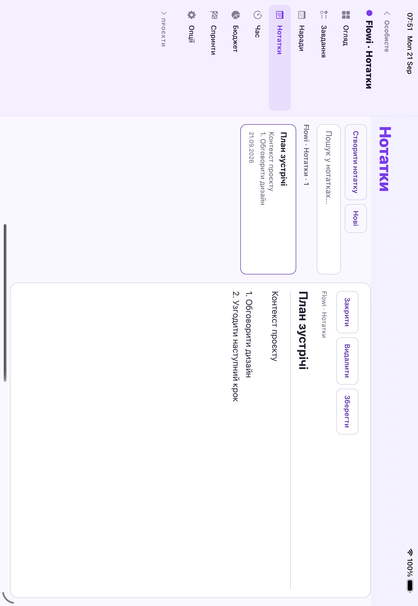
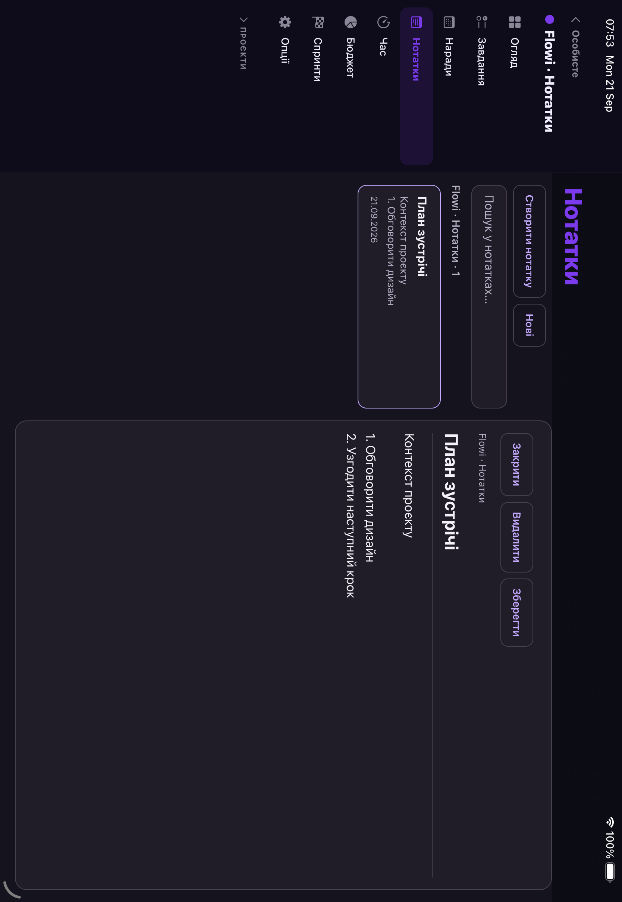

# Flowi — нотатки: перший етап реалізації

Дата: 2026-09-21. Мобільний застосунок, гілка `feat/notes-ipad-workspace`.
Цей чекпойнт стосується текстових нотаток. Він не закриває весь E3 (iPad), E4 (синхронізація) або режим Apple Pencil.

## Збереження змін у Git

Окрема локальна гілка `feat/notes-ipad-workspace` містить реалізацію нотаток, перевірки та цей звіт зі скриншотами. Гілку створено від перевіреного стану `958abc4`; попередню гілку аудиту збережено без переписування історії.

- `adce9a6` — спільний редактор, групування за проєктами, адаптивне відображення, захист збереження та регресійні перевірки.
- `958abc4` — виправлення безпечних відступів iPad (NOTES-01), нативні перевірки розкладки та візуальні докази.
- Окремий документаційний коміт фіксує цей опис передачі результату в новій гілці.

Зміни збережено локально; публікація гілки й розгортання не виконувались. Оновлення цього розділу не змінює код: результати перевірок нижче стосуються реалізації, зазначеної вище.

## Перевірений початковий стан

Release-збірка на наявному iPad Pro 11 (audit), iOS 26.3. Вхід у спеціально створену локальну базу тестового стенду. На екрані «Нотатки» створення відкривало невелику нижню панель; решта площі планшета затемнювалась і не використовувалась редактором.

Доказ: [початковий редактор](evidence/notes-ipad/before.png).

## Що реалізовано

- Єдиний компонент редактора для особистого списку й розділу конкретного проєкту.
- На expanded — список і колонка деталі. На compact/medium — список або редактор. Наявні сайдбари не переписані.
- Пошук за заголовком і текстом; фільтри всіх/особистих/проєктних нотаток; секції з назвами проєктів; сортування за датою або назвою.
- Створення в проєкті відразу задає його `projectId`. Особистий екран агрегує ці ж записи, без дублювання колекцій.
- Глядач проєкту отримує режим читання й у загальному списку. Закриття не виконує приховане збереження.
- При незбережених правках вихід і перемикання нотатки потребують свідомого відкидання. Стан редактора зберігається при зміні розмірного класу.
- Явне збереження очікує локального запису та запису в наявну чергу синхронізації. При помилці редактор лишається відкритим. Повторна спроба відновлює запис у чергу навіть після частково успішної попередньої операції.
- Збереження накладає тільки змінені поля конкретної нотатки на свіжу колекцію. Воно не замінює колекцію відфільтрованим списком.
- Помилка читання відображається окремо; створення й збереження заблоковані до відновлення читання.
- Елементи керування мають власну рамку не менше 44 pt. Нові рядки внесені в єдиний словник uk/en.

## Автоматична перевірка

- TypeScript: без помилок.
- Повний Jest: 133 набори, 1800 тестів пройшли.
- Нові 9 регресій: ізоляція проєктів, одночасна правка іншого поля, роль глядача, помилка диска, зміна ширини, пошук, зіпсоване сховище, живе оновлення, повтор після збою outbox, повтор видалення. Деякі сценарії об'єднані в одному тесті.
- Нативний повторюваний сценарій: `e2e-native/flows/regression-notes.yaml` (локальний тестовий акаунт, українська мова; створює і видаляє лише власну тестову нотатку).

## Межі цього етапу

- Формат запису лишається `id/title/body/createdAt/updatedAt/projectId`; міграції БД і серверні контракти не змінювались.
- Apple Pencil, рукописні вкладення, блоки, OCR, стійкі чернетки після завершення процесу та історія версій ще не реалізовані. Не показано неактивний перемикач, який удавав би готову функцію.
- Локальний запис і outbox — два окремі записи AsyncStorage. Повтор після виявленої помилки покритий; аварійне завершення процесу між ними потребує окремого E4-рішення про атомарність/журнал.
- Успішне локальне збереження не означає підтвердження сервера. Повна перевірка між web/mobile, конфліктів, офлайн і відновлення належить E4.
- Успадкований фолбек ролей до першого завантаження лишається чинним; окремий аудит холодного старту прав доступу ще потрібний.
- Весь E3 також включає Задачі, Простір проєкту, Split View та Stage Manager; цей чекпойнт не видає їх за завершені.
- Web і server у цьому етапі не редагувались. Продакшн не використовувався. Пуш не виконувався.

## Нативна перевірка

Фінальна Release-збірка успішна. На iPad Pro 11 (audit), iOS 26.3, локальний тестовий workspace. Після виправлення NOTES-01 повний сценарій розкладки повторно пройшов у світлій і темній темах:

| Сценарій | Результат |
|---|---|
| Створити особисту нотатку, ввести заголовок і текст | Пройдено |
| Зберегти, знайти й повторно відкрити той самий текст | Пройдено |
| Пошук без збігів | Пройдено |
| Підтвердити видалення лише тестової нотатки | Пройдено |
| Відкрити нотатку конкретного проєкту | Пройдено |
| Портрет: редактор без зайвого списку поруч | Пройдено |
| Ландшафт: сайдбар + список + деталь | Пройдено |
| Поворот із незбереженим текстом | Текст збережено в редакторі |
| Відкинути правку та відкрити цю ж нотатку в особистому списку | Пройдено |

На локальному сервері також спостерігались створені з iPad особисті нотатки та tombstone видаленої нотатки. Проєктна тестова нотатка прийшла із серверного потоку й відображалась у двох контекстах. Це вузький smoke синхронізації, а не повний E4 чи перевірка web↔mobile.

При першому прогоні впала системна оболонка симулятора (`SpringBoard probably crashed`). Після перезапуску того самого пристрою та завершення затриманого системного запуску перевірки відновились. Дані не очищувались, зайві симулятори не створювались. Сценарій уточнено: унікальна назва через `-e NOTE_TITLE=...`, вибір картки за id, підтвердження видалення нижче тексту діалогу. `hideKeyboard` прибрано: на цьому iPad його допоміжний тап міг відкрити картку під клавіатурою.

### NOTES-01 — нижній безпечний відступ

Під час живого огляду виявлено, що `KeyboardAvoidingView` із поведінкою `padding` перекривав нижній відступ кореневого стилю; край редактора заходив під системний індикатор. Відступ перенесено у внутрішній контейнер, для компактного проєктного режиму також враховано наявну нижню панель навігації.

Фінальна перевірка після цієї правки: TypeScript, ESLint та 9 тестів редактора пройшли. Повний набір до цієї правки розкладки: **133/133 набори, 1800/1800 тестів**.

### Повторення перевірок

Тільки на локальному тестовому акаунті, послідовно:

```sh
MAESTRO_DRIVER_STARTUP_TIMEOUT=300000 maestro --device <ipad-udid> test -e NOTE_TITLE=Notes-unique-run e2e-native/flows/regression-notes.yaml
MAESTRO_DRIVER_STARTUP_TIMEOUT=300000 maestro --device <ipad-udid> test -e EVIDENCE_DIR=/absolute/evidence/path e2e-native/flows/regression-notes-ipad.yaml
```

Для другого сценарію потрібен локальний проєкт `p-notes-audit` із нотаткою `n-project-audit`; відповідні значення задані в сценарії. Це тестові дані стенду, не продакшн.

Ще не перевірено в цьому чекпойнті: iPhone/Android, віконні режими iPad, повний Dynamic Type/VoiceOver, всі виміри контрасту й країв дотику, продуктивність, ручний прогін англійською. Ці пункти не позначаються пройденими на підставі юніт-тестів.

## Скриншоти остаточної збірки

Світла тема, простір проєкту:



Темна тема, простір проєкту:



[Особистий список із проєктною нотаткою](evidence/notes-ipad/dark/aggregate-landscape.png) · [Поворот із незбереженим текстом і клавіатурою](evidence/notes-ipad/light/portrait-draft.png).

Зразок контрасту основного тексту редактора, виміряний з пікселів цих PNG з урахуванням EXIF-орієнтації: **16.31:1** у світлій темі (RGB 36/28/50 на 255/255/255) і **14.82:1** у темній (244/241/250 на 32/29/41). Це вимір одного текстового зразка, не висновок про відповідність всього застосунку WCAG.
